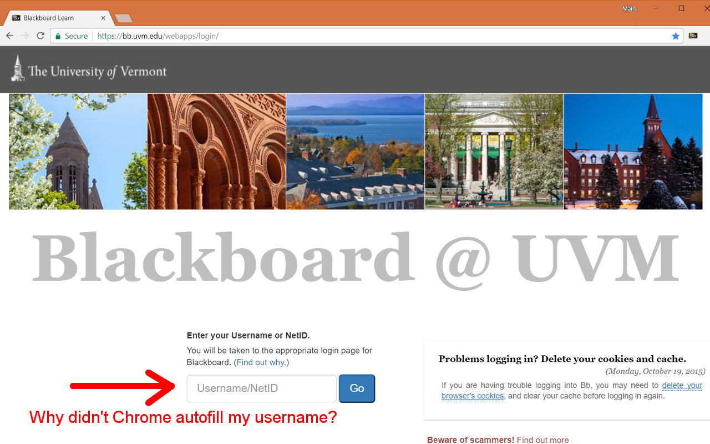
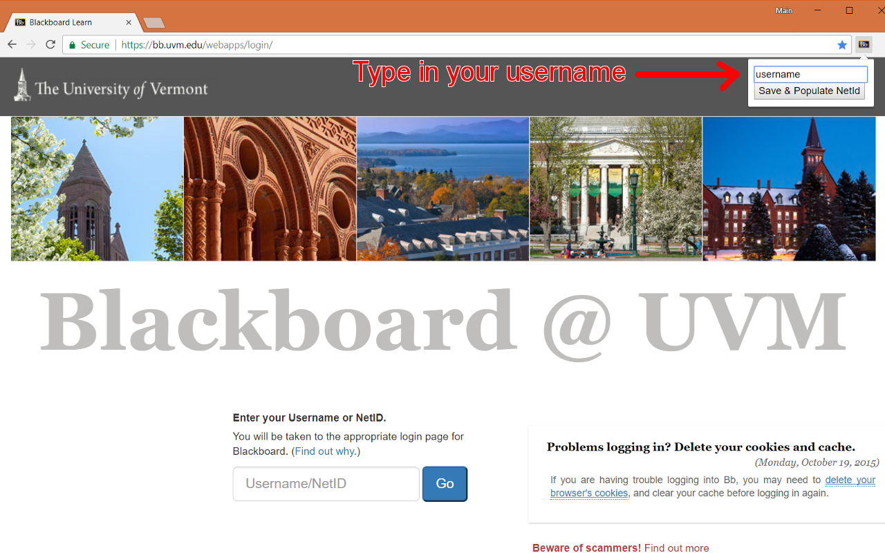
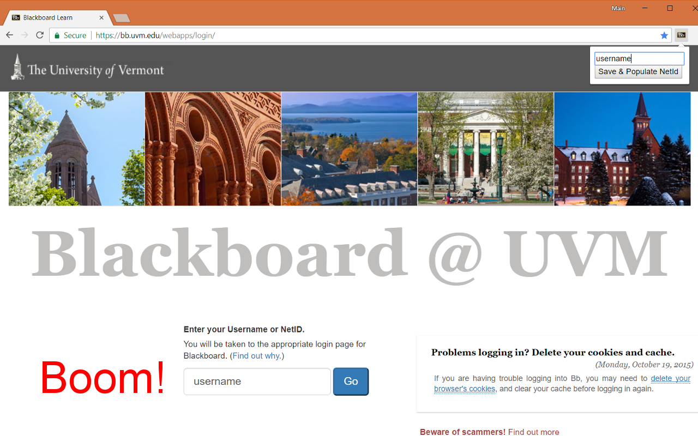

# UVM Blackboard Autofill NetID
Autofill NetID when logging into Blackboard & Chrome doesn't remember it

## [Get Extension from Chrome Web Store](https://chrome.google.com/webstore/detail/uvm-blackboard-autofill-n/chaedfolkmpjklggofnbjkepacoeomje)

### The Problem
Blackboard signs you out and doesn't remember your username even though you said "Save password"

## The Solution
Open the extension & Type in your username/NetID

Hit **Enter** or click the button to populate your NetID into the username field & have it sync with any Chrome browser you sign into

